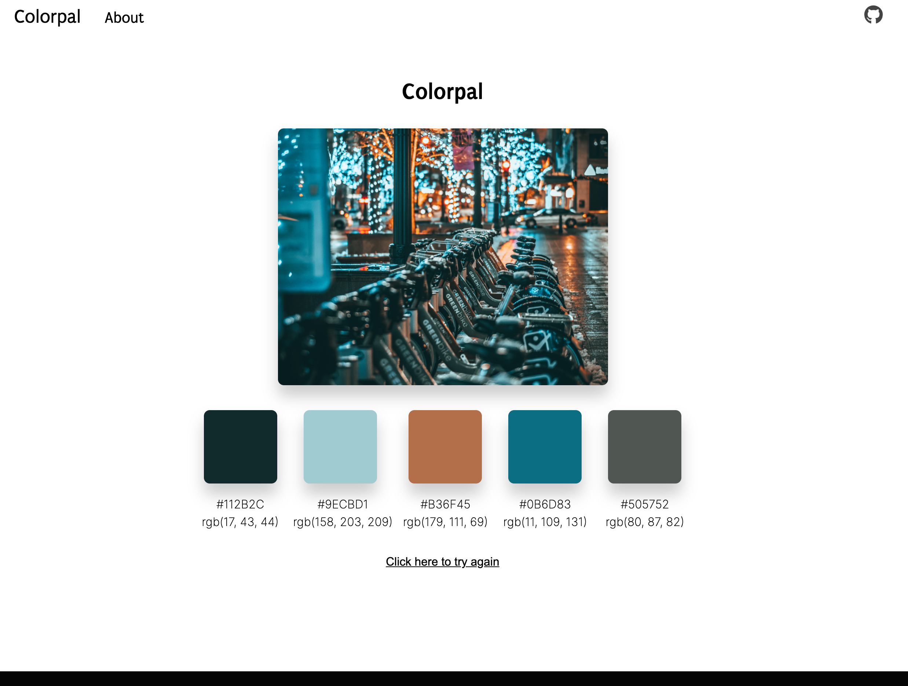

# Colorpal

A web based application that uses a React frontend with a Python/Flask API to extract color palettes from images through the user of OpenCV, image processing techniques and K-Means Clustering. 



## Getting started

### Development

Ensure that you have the following dependencies installed on your computer:
```
Python 3.7
Node 12
Yarn
```

It is reccomended to use [nvm](https://github.com/nvm-sh/nvm) for Node and to use [virtualenv](https://pypi.org/project/virtualenv/) to create your Python environment but this is not required by any means.

Once the core dependencies have been installed you can install all other dependencies for the project by running the following:

```
# Install dependencies for the flask web server
pip install -r requirements.txt

# Install dependencies for the react client application
cd app/client
yarn install
```

Finally, you can run the app. It is recomended to run the app in two different terminal windows. One for the client side app and one for the app.

For the server:
```
bin/dev
```

For the client app:
```
cd app/client
yarn start
```

## Author
* **Mark Schnabel**
    * GitHub - [markschnabel](https://github.com/markschnabel)
    * Linked In - [mark-j-schnabel](https://github.com/markschnabel)
    * [mark.schnabel@markschnabel.com](mailto:mark.schnabel@markschnabel.com)

## License

The MIT License (MIT)

Copyright (c) 2019 Mark Schnabel <mark.schnabel@markschnabel.com>

Permission is hereby granted, free of charge, to any person obtaining a copy of this software and associated documentation files (the "Software"), to deal in the Software without restriction, including without limitation the rights to use, copy, modify, merge, publish, distribute, sublicense, and/or sell copies of the Software, and to permit persons to whom the Software is furnished to do so, subject to the following conditions:

The above copyright notice and this permission notice shall be included in all copies or substantial portions of the Software.

THE SOFTWARE IS PROVIDED "AS IS", WITHOUT WARRANTY OF ANY KIND, EXPRESS OR IMPLIED, INCLUDING BUT NOT LIMITED TO THE WARRANTIES OF MERCHANTABILITY, FITNESS FOR A PARTICULAR PURPOSE AND NONINFRINGEMENT. IN NO EVENT SHALL THE AUTHORS OR COPYRIGHT HOLDERS BE LIABLE FOR ANY CLAIM, DAMAGES OR OTHER LIABILITY, WHETHER IN AN ACTION OF CONTRACT, TORT OR OTHERWISE, ARISING FROM, OUT OF OR IN CONNECTION WITH THE SOFTWARE OR THE USE OR OTHER DEALINGS IN THE SOFTWARE.
